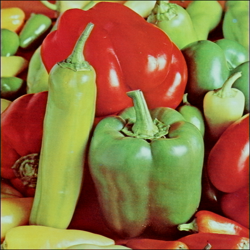
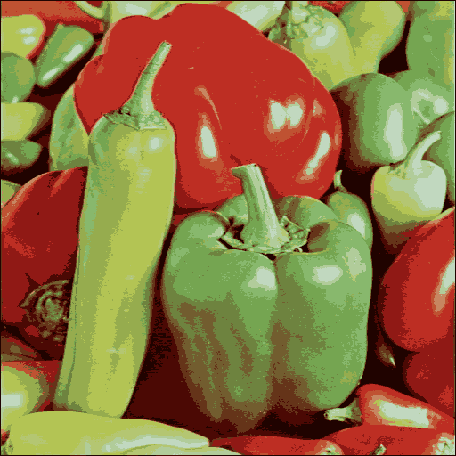
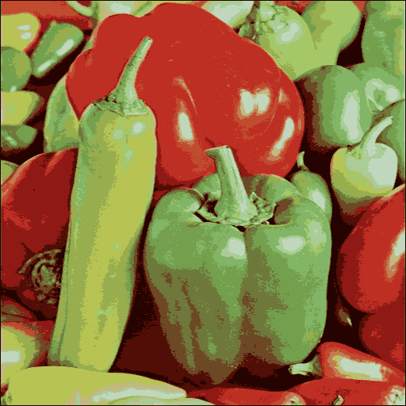

## K-means Image Compression

### Introduction

This project demonstrates how K-means clustering can be used to compress images.
It applies both non-optimized and optimized versions of the algorithm to iconic test images ("Lena" and "Peppers").
The results highlight how compression reduces file size while preserving visual quality.

### Prerequisites

- Python 3.8 or higher

- Libraries required:

- NumPy

- Matplotlib

- PIL (Python Imaging Library)

### How to Run

1. Clone the repository or download the project files.

2. Install the required dependencies:

- pip install numpy matplotlib pillow

3. Open and run the Jupyter Notebook or Python script to process the images.

---

### Results

Lena Images

1. Original Image

2. Compressed Image (Non-Optimized)

3. Compressed Image (Optimized)

Peppers Images

1. Original Image

2. Compressed Image (Non-Optimized)

3. Compressed Image (Optimized)

---

### Key Features

- Non-optimized K-means: Implements a basic clustering algorithm for image compression.

- Optimized K-means: Uses improved techniques for better speed and efficiency.

### Code Workflow

1. Image Loading: Load images and convert them into arrays using PIL.

2. Clustering:

- Groups similar pixel intensities using K-means.

- Iteratively updates cluster centers to minimize variance.

3. Compression: Replaces pixel values with their nearest cluster center.

4. Optimization: Enhances the clustering process for better performance.

5. Visualization: Generates comparisons of the original, non-optimized compressed, and optimized compressed images.

### References

- K-means Clustering Algorithm

- Python documentation for NumPy, Matplotlib, and PIL.

